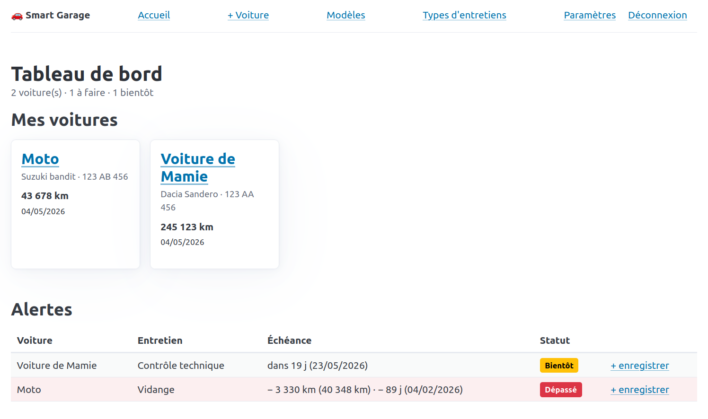

<h1 align="center">
  <br>
  <a href="https://www.associés.fr"></a>
</h1>


# 🚗 Smart Garage

A simple, self-hosted personal car fleet manager. Track maintenance, get alerts before things are due, store invoices — all in one lightweight PHP + SQLite application.

**Single user. Self-hosted. No tracking. Your data stays on your server.**

[](https://opensource.org/licenses/MIT)




## Features

- **Dashboard** — quick overview of your cars and upcoming maintenance
- **Cars** — track multiple vehicles with name, model, license plate, in-service date, mileage
- **Car models** — group cars sharing the same maintenance schedule (e.g. *Mégane 3*, *Civic 9*)
- **Recurring maintenance** — define maintenance intervals per model (every X km, every Y months, or both)
- **Smart alerts** — automatic detection of upcoming and overdue maintenance, with two-level warnings (orange = soon, red = overdue)
- **Maintenance history** — record every oil change, brake job, etc., with cost, notes, and PDF/image invoices
- **Multi-language UI** — English & French (easy to add more)
- **Single-user authentication** — first-run setup wizard, secure password hashing, rate limiting on login
- **No external services** — everything runs locally

## Quickstart with Docker (recommended)

```bash
git clone https://github.com/antoinelucas64/SmartGarage.git
cd SmartGarage
docker compose up -d
```

Open `http://localhost:8080` and follow the setup wizard to create your account.

To use a different port:

```bash
SMART_GARAGE_PORT=9090 docker compose up -d
```

Your data is persisted in `./data/` (SQLite database) and `./uploads/` (invoice files).

### Updating

```bash
git pull
docker compose build
docker compose up -d
```

The schema is auto-migrated on startup.

### Backup

The whole application state is just two folders:

```bash
tar czf smart-garage-backup-$(date +%F).tar.gz data/ uploads/
```

## Manual installation (without Docker)

Requires PHP 8.1+ with `pdo_sqlite`, and a web server (nginx, Apache, Caddy...).

```bash
git clone https://github.com/YOUR_USERNAME/smart-garage.git /var/www/smart-garage
cd /var/www/smart-garage
chown -R www-data:www-data .
chmod -R 775 data/ public/uploads/
```

Point your web server's document root to `/var/www/smart-garage/public/`.

### Example nginx config

```nginx
server {
    listen 80;
    server_name garage.example.com;
    root /var/www/smart-garage/public;
    index index.php;

    client_max_body_size 16m;

    # Block direct access to invoice files
    location ^~ /uploads/ {
        deny all;
        return 404;
    }

    location / {
        try_files $uri $uri/ /index.php?$query_string;
    }

    location ~ \.php$ {
        include fastcgi_params;
        fastcgi_pass unix:/run/php/php8.3-fpm.sock;
        fastcgi_param SCRIPT_FILENAME $document_root$fastcgi_script_name;
    }
}
```

### YunoHost users

Smart Garage works well behind YunoHost's existing nginx + PHP-FPM. Drop the
project under `/var/www/smart-garage` and add a `location` block to your
domain's config file (in `/etc/nginx/conf.d/<domain>.d/`). To restrict access
to your local network only, add `allow 192.168.0.0/16; deny all;` inside the
`location` block.

## Configuration

Smart Garage reads optional environment variables:

| Variable      | Default              | Description                                  |
|---------------|----------------------|----------------------------------------------|
| `DATA_DIR`    | `./data`             | Where the SQLite database lives              |
| `UPLOADS_DIR` | `./public/uploads`   | Where invoice files are stored               |
| `APP_DEBUG`   | `0`                  | Set to `1` to display PHP errors (dev only)  |

In Docker, `DATA_DIR=/data` and `UPLOADS_DIR=/uploads` by default — both are mounted as volumes via docker-compose.

## How it works

### Car models and recurring maintenance

A **model** (e.g. *Fiat Multipla 1.9 JTD*) holds a list of recurring maintenance items:

| Maintenance         | Every km  | Every months |
|---------------------|-----------|--------------|
| Oil change          | 15,000    | 12           |
| Timing belt         | 120,000   | 60           |
| Brake fluid         | —         | 24           |
| Vehicle inspection  | —         | 24           |

When you add a **car** of that model, Smart Garage computes alerts based on:

- The last maintenance record of that type, **or**
- The car's in-service date if none yet

### Alert levels

- 🟢 **OK** — more than 1,000 km / 30 days away
- 🟡 **Soon** — within 1,000 km or 30 days
- 🔴 **Overdue** — past the due km or date

## Tech stack

- **Backend:** PHP 8 with PDO, no framework
- **Database:** SQLite (single file, WAL journaling)
- **Frontend:** Pico.css (no build step), htmx loaded for future enhancements
- **Container:** nginx + php-fpm + supervisord on Alpine (~80 MB image)

## Project structure

```
smart-garage/
├── public/
│   ├── index.php          # router
│   └── uploads/           # invoices (served via authenticated PHP only)
├── src/
│   ├── auth.php           # session + login + rate limiting
│   ├── db.php             # PDO + schema migrations
│   ├── i18n.php           # translation loader
│   ├── helpers.php        # alerts, formatting
│   ├── controllers/       # one file per route
│   ├── views/             # PHP templates
│   └── lang/              # en.php, fr.php
├── data/                  # SQLite DB (gitignored)
├── docker/                # nginx, php-fpm, supervisord configs
├── schema.sql
├── Dockerfile
└── docker-compose.yml
```

## Adding a language

1. Copy `src/lang/en.php` to `src/lang/xx.php`
2. Translate every value
3. Add it to the `$available` array in `src/i18n.php`

## Security notes

- Passwords are hashed using PHP's `password_hash()` (bcrypt)
- Sessions use httpOnly + SameSite=Lax cookies
- Login rate limiting: 5 failed attempts per IP per 10 minutes
- Invoice files are stored outside the public web root and served only after authentication
- The app is **single-user by design** — no role/permission system
- For maximum security, run behind HTTPS and restrict access to trusted networks

## Roadmap

Pull requests welcome! Some ideas:

- Cost charts per car
- CSV export of maintenance history
- Calendar view of upcoming maintenance
- Mileage estimation between readings (avg km/day)
- Email reminders for overdue maintenance
- More languages

## Development

Run locally without Docker:

```bash
php -S localhost:8000 -t public
```

Then open `http://localhost:8000`.

Syntax-check all PHP files:

```bash
find . -name "*.php" -not -path "./vendor/*" -exec php -l {} \;
```

## License

[MIT](LICENSE)

## Acknowledgments

- [Pico.css](https://picocss.com/) for the gorgeous minimal styling
- [htmx](https://htmx.org/) for keeping the frontend simple
